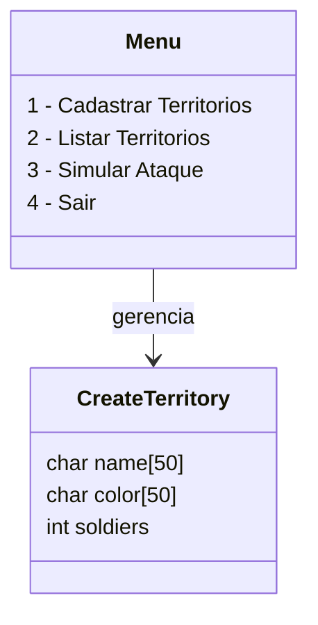

# 🗺️ Game War em C

Um projeto em **C** para gerenciar territórios e simular batalhas em um jogo de estratégia simplificado.  
Feito como exercício de aprendizado em **estruturas (`struct`)**, **enum**, **menus interativos**, **arrays dinâmicos** e **simulação de combate**.

---

## ⚠️ Aviso de compatibilidade

Este programa foi feito para rodar em **terminal (CMD, PowerShell ou Linux Terminal)**.  
Dependendo do terminal, **acentos, barras e emojis podem não aparecer corretamente**.  

✅ **Recomendações**:
- Prefira **PowerShell** ou **Windows Terminal** para melhor visualização.  
- Para CMD, adicione no início do `main()`:
  ```c
  system("chcp 65001");
  ```
- Evite emojis e acentos se rodar apenas no CMD clássico.

---

## 📦 Funcionalidades

- ✅ Cadastro de territórios com **nome**, **cor** e **quantidade de tropas**  
- 📋 Listagem de territórios cadastrados  
- ⚔️ Simulação de ataques entre territórios:
  - Dano proporcional às tropas
  - Chance aleatória de defesa ou ataque sem perdas
  - Redistribuição de tropas após vitória ou derrota
- 🧹 "Limpar tela" simulada imprimindo múltiplas linhas  
- 🚪 Sair do programa com confirmação

---

## 🧠 Tecnologias utilizadas

- **Linguagem:** C  
- **Interface:** Terminal (CLI)  
- **Organização:** `struct`, `enum`, `switch-case`, arrays dinâmicos  
- **Compatível com:** Windows e Linux (sem dependências externas)  

---

## 🚀 Como compilar e executar

### 🔹 Windows (MinGW)
```bash
gcc -o war.exe war.c
./war.exe
```

### 🔹 Linux
```bash
gcc -o war war.c
./war
```

---

## 🖼️ Exemplo de uso

```text
Turno 0
Brasil [████████████████████] 50
Argentina [██████████████    ] 40
Ataque: Isso foi devastador... (20)

Turno 1
Brasil [████████████████    ] 30
Argentina [████████████      ] 30
Defesa: tivemos muitas baixas! (15)

🏆 O atacante conquistou o território!
```

---

## 🗂️ Estruturas e enums

### `struct CreateTerritory`
```c
typedef struct {
    char name[50];      // Nome do território
    char color[50];     // Cor do território
    int  soldiers;      // Número de soldados
} CreateTerritory;
```

### `enum Menu`
```c
typedef enum {
    CADASTRAR = 1,
    LISTAR_TERRITORY,
    SIMULAR_ATAQUE,
    SAIR
} Menu;
```
- Controla o menu principal do jogo.

---

## 🗂️ Diagrama do sistema



---

## 🛠️ Melhorias futuras / implementadas

- [x] Cadastro e listagem de territórios  
- [x] Simulação de batalhas entre territórios  
- [ ] Permitir edição de territórios já cadastrados  
- [ ] Limpar tela de forma real (`system("cls")` ou `system("clear")`)  
- [ ] Persistência em arquivo (`.txt`)  
- [ ] Ampliar limite de territórios (`MAX_TERRITORY`)  
- [ ] Melhorar IA de combate e redistribuição de tropas  
- [ ] Adicionar inventário e recursos extras

---

## 🤝 Contribuição

Contribuições são bem-vindas!  
Abra uma **Issue** ou envie um **Pull Request** para melhorias ou sugestões.

---

## 📜 Licença

Licença **MIT**.  
Você pode usar, modificar e distribuir livremente, mantendo os créditos.

