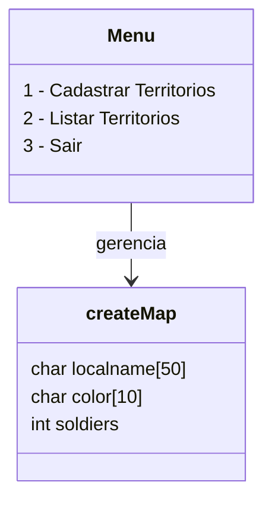

# 🗺️ Game War Simplificado em C

Um projeto introdutório feito em **C** para gerenciar territórios em um jogo de estratégia simplificado.  
Criado como exercício de aprendizado em **estruturas (`struct`)**, **menus interativos** e **manipulação de arrays fixos**.

---

## ⚠️ Aviso de compatibilidade

Este programa foi feito para rodar em **ambiente de terminal (CMD)**.  
Dependendo do terminal utilizado, **acentos e caracteres especiais podem não ser exibidos corretamente**.  

Isso ocorre especialmente no CMD clássico do Windows, que não possui suporte completo a **UTF-8** por padrão.

✅ **Recomendações**:
- Prefira rodar no **PowerShell** ou **Windows Terminal** para melhor visualização.  
- Caso use o CMD e queira ativar UTF-8, adicione no início do `main()`:
  ```c
  system("chcp 65001");
  ```
- Se for rodar exclusivamente no CMD, **evite emojis e acentos** para não comprometer a legibilidade.  

---

## 📦 Funcionalidades

- ✅ Cadastro de territórios com **nome**, **cor** e **quantidade de tropas**  
- 📋 Listagem de territórios cadastrados  
- 🚪 Opção para sair com confirmação  
- 🧹 "Limpar tela" simulada imprimindo múltiplas linhas  

---

## 🧠 Tecnologias utilizadas

- **Linguagem:** C  
- **Interface:** Terminal (CLI)  
- **Organização:** `struct`, `switch-case` e arrays fixos  
- **Compatível com:** Windows e Linux (sem dependências externas)  

---

## 🚀 Como compilar e executar

### 🔹 Windows (MinGW)
```bash
gcc -o war.exe war.c
./war.exe
```

### 🔹 Linux
```bash
gcc -o war war.c
./war
```

---

## 🖼️ Exemplo de uso

```text
|===========|GAME WAR|================|
--Seja Bem Vindo ao War--

 1-Cadastrar Territorios
 2-Listar Territorios
 3-Sair

Escolha uma opcao: 1
Digite o Nome do Territorio: Brasil
Digite a Cor do Territorio: Verde
Digite a Quantidade de Tropas: 50

Você deseja continuar atribuindo territorios? (y/n): y
Digite o Nome do Territorio: Argentina
Digite a Cor do Territorio: Azul
Digite a Quantidade de Tropas: 40

========= Territorios Cadastrados =========
1) Nome do Territorio/Nacao: Brasil
   Cor do Territorio: Verde
   Forcas Terrestres: 50
========================
2) Nome do Territorio/Nacao: Argentina
   Cor do Territorio: Azul
   Forcas Terrestres: 40
========================
```

---

## 🗂️ Diagrama do sistema



---

## 🛠️ Melhorias futuras 

- [ ] Permitir edição de territórios já cadastrados  
- [ ] Limpar tela de forma real (ex: `system("cls")` no Windows e `system("clear")` no Linux)  
- [ ] Adicionar persistência em arquivo (`.txt`)  
- [ ] Ampliar limite de territórios (`MAX_TERRITORY`)  
- [ ] Simulação de batalhas entre territórios  

---

## 🤝 Contribuição

Esse projeto foi feito como aprendizado, mas contribuições são bem-vindas!  
Se quiser melhorar o código, abra uma **Issue** ou envie um **Pull Request**.  

---

## 📜 Licença

Este projeto está sob a licença **MIT**.  
Você pode usá-lo, modificá-lo e distribuí-lo livremente, desde que mantenha os créditos.  
